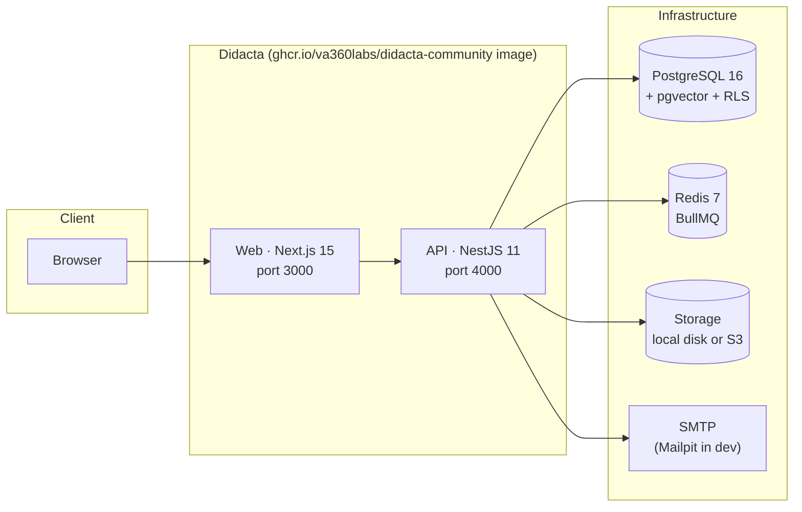

# Architecture

A high-level view of how Didacta is built and how its pieces fit together in an installation.

## The pieces of an installation

- **A single Docker image** (`ghcr.io/va360labs/didacta-community`) contains both the web app and the API. On first start it automatically applies the versioned Prisma migrations, the RLS policies and the idempotent system seed.
- **PostgreSQL 16** requires the **pgvector** extension (the AI layer stores embeddings in `vector` columns). The official compose file uses the `pgvector/pgvector:pg16` image.
- **Redis 7** backs the cache and the job queues (BullMQ): the event outbox, email delivery and background tasks.
- **Storage**: local disk by default (the `didacta_data` volume) or any S3-compatible provider.

## Multi-tenant from the core

Didacta is multi-tenant by design:

- Each organisation is a **tenant**; the active tenant is resolved from the request host.
- **Every table carries `tenant_id`** and a **Row-Level Security** policy in PostgreSQL. Policies are auto-discovered and reapplied on every start, so one tenant's data is invisible to the rest even in the face of an application bug.
- Everything specific to an installation (branding, domains, copy) is **tenant configuration or tenant data**, never code: the product is whitelabel out of the box.

## Core + modules

The repository is a monorepo (Turborepo + pnpm workspaces) with three areas:

| Area | What it contains |
| --- | --- |
| `apps/` | `api` (NestJS), `web` (Next.js) and `e2e` (Playwright). |
| `packages/` | The shared core: `core-kernel` (events/hooks), `core-registry` (module registry and lifecycle), `database` (Prisma + RLS), `license-sdk` (Enterprise license validation), `module-package-spec` (the module package contract). |
| `modules/` | The functional modules (courses, assessments, certificates, gamification…). Each one with its manifest, its `mod_<slug>_*` tables and its isolated logic. |

The isolation rules between modules (no cross imports, no foreign keys across modules, communication through events and hooks) are explained in [Modules → How they work](../modulos/index.md).

## The AI Gateway (BYOK)

Didacta's AI goes through a **multi-provider gateway** in the API: each installation configures its own LLM provider and API key (Bring Your Own Key). No provider is hardwired into the product. See [Configuring AI](../configuracion/ia.md).

## Editions and gating

Enterprise capabilities live in `*.ee.*` files inside the core, covered by their own license, and are unlocked with a signed JWT (ES256) validated by `license-sdk`. Modules are never gated. See [Editions](ediciones.md) and [Enterprise](../enterprise/index.md).
