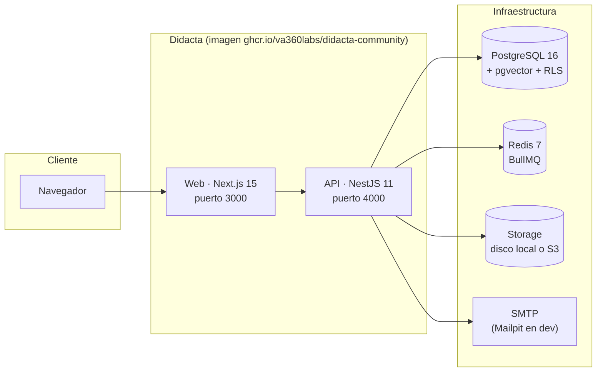

# Arquitectura

Visión de alto nivel de cómo está construido Didacta y cómo se relacionan sus piezas en una instalación.

## Piezas de una instalación

- **Una sola imagen Docker** (`ghcr.io/va360labs/didacta-community`) contiene la web y la API. En el primer arranque aplica automáticamente las migraciones Prisma versionadas, las políticas RLS y el seed idempotente de sistema.
- **PostgreSQL 16** necesita la extensión **pgvector** (la IA guarda embeddings en columnas `vector`). El compose oficial usa la imagen `pgvector/pgvector:pg16`.
- **Redis 7** respalda la cache y las colas de trabajos (BullMQ): outbox de eventos, envío de emails, tareas en segundo plano.
- **Storage**: disco local por defecto (volumen `didacta_data`) o cualquier proveedor S3-compatible.

## Multi-tenant desde el núcleo

Didacta es multi-tenant por diseño:

- Cada organización es un **tenant**; el tenant activo se resuelve por el host de la petición.
- **Toda tabla lleva `tenant_id`** y una política de **Row-Level Security** en PostgreSQL. Las políticas se autodescubren y reaplican en cada arranque, de modo que los datos de un tenant son invisibles para el resto incluso ante un bug de aplicación.
- Todo lo específico de una instalación (marca, dominios, textos) es **configuración o datos de tenant**, nunca código: el producto es whitelabel de serie.

## Core + módulos

El repositorio es un monorepo (Turborepo + pnpm workspaces) con tres zonas:

| Zona | Qué contiene |
| --- | --- |
| `apps/` | `api` (NestJS), `web` (Next.js) y `e2e` (Playwright). |
| `packages/` | El core compartido: `core-kernel` (eventos/hooks), `core-registry` (registro y ciclo de vida de módulos), `database` (Prisma + RLS), `license-sdk` (validación de licencia Enterprise), `module-package-spec` (contrato de paquetes de módulo). |
| `modules/` | Los módulos funcionales (cursos, evaluaciones, certificados, gamificación…). Cada uno con su manifest, sus tablas `mod_<slug>_*` y su lógica aislada. |

Las reglas de aislamiento entre módulos (sin imports cruzados, sin FKs entre módulos, comunicación por eventos y hooks) están explicadas en [Módulos → Cómo funcionan](../modulos/index.md).

## El AI Gateway (BYOK)

La IA de Didacta pasa por un **gateway multi-proveedor** en la API: cada instalación configura su proveedor LLM y su clave (Bring Your Own Key). Ningún proveedor está cableado en el producto. Ver [Configurar la IA](../configuracion/ia.md).

## Ediciones y gating

Las capabilities Enterprise viven en ficheros `*.ee.*` dentro del core, cubiertos por una licencia propia, y se desbloquean con un JWT firmado (ES256) que valida `license-sdk`. Los módulos nunca se gatean. Ver [Ediciones](ediciones.md) y [Enterprise](../enterprise/index.md).
